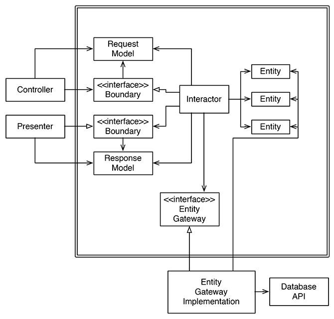

Several years ago I came across the following video. It was a keynote from a Ruby conference by some guy named Robert "Uncle Bob" Martin. It's really worth your time to watch.



Watching this opened my eyes. The idea that the framework is a delivery mechanism and not your app was completely new to me. I had been working on an app that I built using [Kohana](https://kohanaframework.org/) which was getting really hard to maintain.

I had never worked at a company with senior developers who talked about best practices or strategies for architecting applications. The idea of writing your application separate from the framework and interacting with it through use cases was foreign to me.

I picked up Uncle Bob's book [Clean Code](http://amzn.to/2coMG2i) and bought some of his videos on [Clean Coders](https://cleancoders.com/).

I hope to talk more about what he covers in those resources, but today I want to talk more about Clean Architecture.

In August 2012 almost a year after he gave the talk at Ruby Midwest he wrote a post titled [The Clean Architecture](https://8thlight.com/blog/uncle-bob/2012/08/13/the-clean-architecture.html) on his companies blog.

The Clean Architecture

> The concentric circles represent different areas of software. In general, the further in you go, the higher level the software becomes. The outer circles are mechanisms. The inner circles are policies.
> The overriding rule that makes this architecture work is The Dependency Rule. This rule says that source code dependencies can only point inwards. Nothing in an inner circle can know anything at all about something in an outer circle. In particular, the name of something declared in an outer circle must not be mentioned by the code in an inner circle. That includes functions, classes, variables, or any other named software entity.
> By the same token, data formats used in an outer circle should not be used by an inner circle, especially if those formats are generated by a framework in an outer circle. We don’t want anything in an outer circle to impact the inner circles.
>
> <cite>[Uncle Bob](https://8thlight.com/blog/uncle-bob/2012/08/13/the-clean-architecture.html)</cite>

This has been the number one influence on how I write software.

This is one of the key motivators for me creating this blog. I hope to help PHP developers discover tools and techniques that help them become better, more productive developers.

