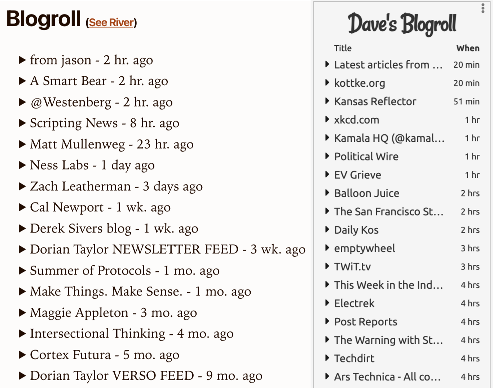

Dave Winer has been working on something interesting. He's [modernized the blogroll](https://blogroll.social/) from the early days of blogging by combining it with an RSS aggregator. This lets you interact with the blogroll and see what posts have been published recently.

Today, I finally had the time and mental energy to investigate and implement one on [my homepage](/).

You'll immediately see that mine looks similar but different from [Dave's](https://scripting.com/). That's because we have different tech stacks, and I wanted to use something other than jQuery. My homepage was also not designed for a sidebar.

<figure>

<figcaption>Side-by-side comparison of my blogroll and Dave's</figcaption>
</figure>

However, our blogrolls are both powered by the very capable [FeedLand aggregator](https://feedland.com/).

For my blogroll, I decided to build it as a [Web Component](https://developer.mozilla.org/en-US/docs/Web/API/Web_components) with no dependencies. You can take a look at [the blogroll source on GitHub](https://github.com/andrewshell/blog-asdo-11ty/blob/master/public/js/blog-roll.js).
